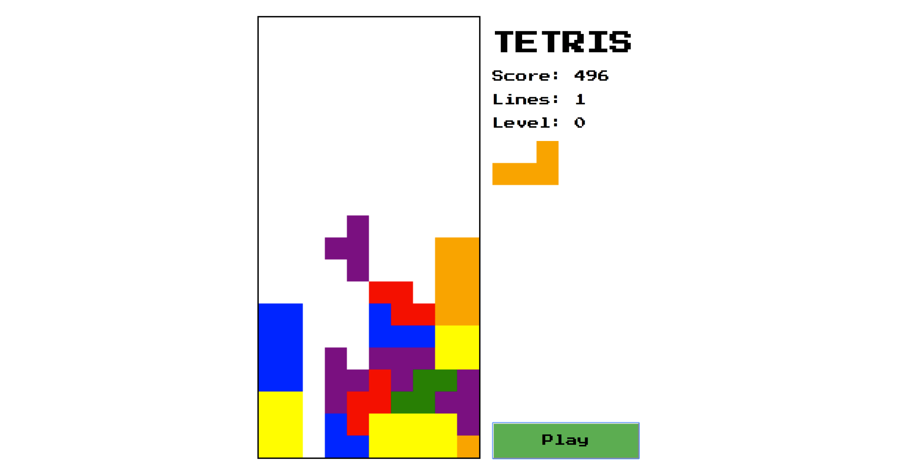

# ng-tetris

Tetris game in Angular. 

## Development server

Run `npm start` for a dev server. Navigate to `http://localhost:4200/`. The app will automatically reload if you change any of the source files.

## Build

Run `ng build` to build the project. The build artifacts will be stored in the `dist/` directory. Use the `--prod` flag for a production build.

Link of the game : https://tetris-1ae6c.web.app/
